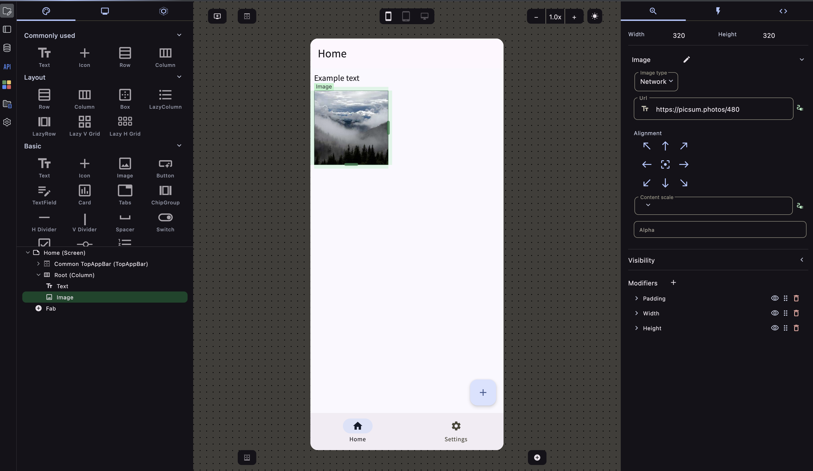

Welcome to **ComposeFlow**, the ultimate visual development platform for creating modern, cross-platform applications. With ComposeFlow, you can effortlessly build apps targeting **Android**, **iOS**, and the **Web** using a powerful drag-and-drop **UI builder** based on **Compose Multiplatform**.

## Key Features

### Visual Development Platform with Drag-and-Drop UI Builder

ComposeFlow offers an intuitive visual interface that allows you to design user interfaces by simply dragging and dropping components. This eliminates the need for complex coding, enabling developers of all skill levels to create sophisticated UIs with ease.

- **Compose Multiplatform Support**: Build your app once and deploy it across Android, iOS, and Web platforms.
- **Rich Component Library**: Access a wide range of pre-built UI components to accelerate your development process.
- **Real-Time Preview**: Instantly see how your app looks and behaves as you design it.
- **AI-Assisted Development**: Create and modify entire screens or project architecture using natural language descriptions through integrated AI agents.

### AI-Assisted Development

ComposeFlow includes powerful AI agents that revolutionize how you build applications. Create and modify your entire project using natural language descriptions.

- **AI Screen Creator**: Generate complete screens from scratch by describing what you want to build.
- **AI Chat Interface**: Modify existing screens, create app states, data types, and implement cross-screen functionality through conversational commands.
- **Project-Wide Intelligence**: AI understands your project context and can work with existing components, themes, and data structures.

**Learn more**: See the [AI Agent Guide](/guides/ai_agent) for detailed instructions and best practices.

### Native Mobile Application Deployment

Take your applications to the next level by deploying them as native mobile apps. ComposeFlow simplifies the process of publishing your apps to the **Android** and **iOS** app stores.

- **Seamless Integration**: Generate platform-specific code and assets required for native deployment.
- **App Store Ready**: Ensure your apps meet the guidelines and requirements of Google Play and the Apple App Store.
- **Optimized Performance**: Deliver native performance and responsiveness on both Android and iOS devices.

### Firebase Integration

Enhance your apps with powerful backend capabilities through built-in **Firebase** integration. ComposeFlow makes it effortless to incorporate user authentication and database connectivity into your applications.

- **User Authentication**: Implement secure sign-in and user management features with minimal setup.
- **Realtime Database**: Connect your app to Firebase's Realtime Database for dynamic data storage and retrieval.
- **Cloud Firestore Support**: Leverage Firestore for scalable and flexible database solutions.
- **Push Notifications**: Engage your users with targeted push notifications.

:::caution
ComposeFlow is still in an alpha stage, some Firebase integrations are not implemented at this stage.
:::

